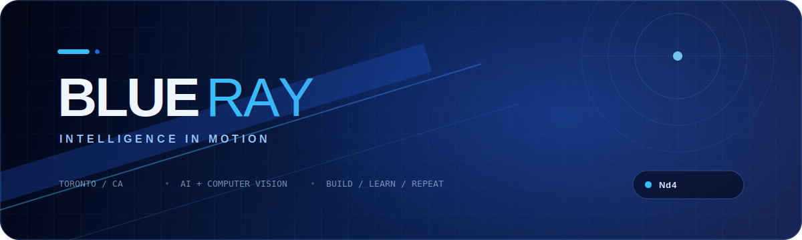

<div align="center">
  
</div>

<div align="center">

[Portfolio](https://blueraymusic.github.io/Portfolio/) · [Projects](https://github.com/blueraymusic?tab=repositories) · [LinkedIn](https://www.linkedin.com/in/adelsissoko/) · [LeetCode](https://leetcode.com/u/blueraymusic/)

</div>

<br />

## Hello, I’m Adel.

I’m a computer science student exploring the space where **machine learning**, **computer vision**, and thoughtful software meet. I enjoy turning ambitious ideas into working prototypes—and approaching hard problems the same way I approach a chessboard: observe, calculate, commit.

```text
CURRENT FREQUENCY

01  Building intelligent, human-centered tools
02  Exploring multimodal AI and computer vision
03  Strengthening algorithms through consistent practice
04  Contributing, collaborating, and learning in public
```

## Flagship builds

Original projects that best represent what I’m interested in building now: intelligent systems, useful products, and human-centered interfaces.

<table>
  <tr>
    <td colspan="2" valign="top">
      <h3><a href="https://github.com/blueraymusic/Retinal">01 / Retinal ↗</a></h3>
      <p>A deep-learning system for detecting multiple retinal diseases from fundus images, designed to support earlier diagnosis and more efficient screening.</p>
      <p><code>Python</code> <code>CNN</code> <code>deep learning</code> <code>computer vision</code></p>
    </td>
  </tr>
  <tr>
    <td width="50%" valign="top">
      <h3><a href="https://github.com/blueraymusic/FirstNet">02 / FirstNet ↗</a></h3>
      <p>A community emergency-response network that connects a person requesting help with the <em>right</em> nearby responder—not merely the closest one.</p>
      <p><code>community safety</code> <code>intelligent matching</code> <code>HTML</code></p>
    </td>
    <td width="50%" valign="top">
      <h3><a href="https://github.com/blueraymusic/Mira">03 / MIRA ↗</a></h3>
      <p>A Multimodal Interactive Recognition Agent exploring how software can understand and respond across different forms of input.</p>
      <p><code>multimodal AI</code> <code>recognition</code> <code>human–AI interaction</code></p>
    </td>
  </tr>
  <tr>
    <td width="50%" valign="top">
      <h3><a href="https://github.com/blueraymusic/TeamManage">04 / ADEL ↗</a></h3>
      <p>An AI-powered operations platform for managing projects, tracking field progress, and streamlining report approvals.</p>
      <p><code>TypeScript</code> <code>AI</code> <code>project operations</code></p>
    </td>
    <td width="50%" valign="top">
      <h3><a href="https://github.com/blueraymusic/NeuroQuest">05 / NeuroQuest ↗</a></h3>
      <p>An AI-powered RPG that generates quests, hints, and interactions dynamically as the player progresses.</p>
      <p><code>Python</code> <code>generative AI</code> <code>game systems</code></p>
    </td>
  </tr>
</table>

<div align="right">

**[Explore all repositories →](https://github.com/blueraymusic?tab=repositories)**

</div>

## Collaborations

Projects and larger systems I’ve worked with alongside the open-source community.

<table>
  <tr>
    <td width="50%" valign="top">
      <h3><a href="https://github.com/blueraymusic/Maybe-Finance">Maybe Finance ↗</a></h3>
      <p>An open-source personal-finance platform built to make financial life easier to understand.</p>
      <p><code>Ruby</code> <code>fintech</code> <code>product engineering</code></p>
      <sub>Open-source collaboration</sub>
    </td>
    <td width="50%" valign="top">
      <h3><a href="https://github.com/blueraymusic/OpenSfM">OpenSfM ↗</a></h3>
      <p>A Structure-from-Motion pipeline for reconstructing 3D geometry from images.</p>
      <p><code>Python</code> <code>computer vision</code> <code>3D</code></p>
      <sub>Open-source collaboration</sub>
    </td>
  </tr>
</table>

## Experiments & earlier builds

| Project | What it explores | Built with |
| :--- | :--- | :--- |
| **[LingoShell](https://github.com/blueraymusic/LingoShell)** | Natural-language control for the terminal | Python |
| **[Blueray Music](https://github.com/blueraymusic/Blueray)** | Music paired with immersive background visuals | JavaScript · HTML · CSS |
| **[Chatbot](https://github.com/blueraymusic/Chatbot)** | A ChatGPT-style web assistant with a Python server | Python · JavaScript · HTML · CSS |
| **[ShellBot](https://github.com/blueraymusic/ShellBot)** | An AI command-line assistant | AI tooling · HTML |
| **[Cmd-bot](https://github.com/blueraymusic/Cmd-bot)** | A locally hosted NLP assistant for computer tasks | NLP · Batchfile |
| **[Maze Simulator](https://github.com/blueraymusic/Maze-Simulator)** | Micromouse navigation and simulation | C++ |

## The toolkit

`Python` · `TypeScript` · `JavaScript` · `C++` · `HTML` · `CSS` · `Machine Learning` · `Computer Vision`

## The position

<div align="center">
  
</div>

<div align="center">

### Carlsen–Kasparov · Reykjavík Rapid, 2004

**Position after 29…Bb7 · White to move**

At thirteen, Magnus Carlsen reached this position against the world’s highest-rated player. White is a pawn up, the knight is planted on c6, and every major piece is active. Carlsen chose the practical `30.Nd4`, steering toward a favorable endgame; Kasparov eventually escaped with a draw.

**[Replay the complete game →](https://www.365chess.com/game.php?gid=2899349)**

</div>

## Endgame

```text
┌──────────────────────────────────────────────────────────────┐
│                                                              │
│   Curiosity finds the move. Consistency plays the game.      │
│                                                              │
└──────────────────────────────────────────────────────────────┘
```

I’m open to learning with other builders, contributing to meaningful open-source work, and collaborating on thoughtful AI projects.

<div align="center">

**[See what I’m building](https://github.com/blueraymusic?tab=repositories)** · **[Visit my portfolio](https://blueraymusic.github.io/Portfolio/)** · **[Connect on LinkedIn](https://www.linkedin.com/in/adelsissoko/)**

<sub>Designed and built by <a href="https://github.com/blueraymusic">Blueray</a>.</sub>

</div>
