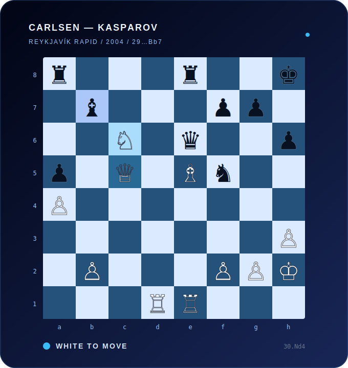

<div align="center">
  
</div>

<div align="center">

### Carlsen–Kasparov · Reykjavík Rapid, 2004

**Position after 29…Bb7 · White to move**

At thirteen, Magnus Carlsen reached this position against the world’s highest-rated player. White is a pawn up, the knight is planted on c6, and every major piece is active. Carlsen chose the practical `30.Nd4`, steering toward a favorable endgame; Kasparov eventually escaped with a draw.

**[Replay the complete game →](https://www.365chess.com/game.php?gid=2899349)**

</div>

## Endgame

```text
┌──────────────────────────────────────────────────────────────┐
│                                                              │
│   Curiosity finds the move. Consistency plays the game.      │
│                                                              │
└──────────────────────────────────────────────────────────────┘
```

I’m open to learning with other builders, contributing to meaningful open-source work, and collaborating on thoughtful AI projects.

<div align="center">

**[See what I’m building](https://github.com/blueraymusic?tab=repositories)** · **[Visit my portfolio](https://blueraymusic.github.io/Portfolio/)** · **[Connect on LinkedIn](https://www.linkedin.com/in/adelsissoko/)**

<sub>Designed and built by <a href="https://github.com/blueraymusic">Blueray</a>.</sub>

</div>
